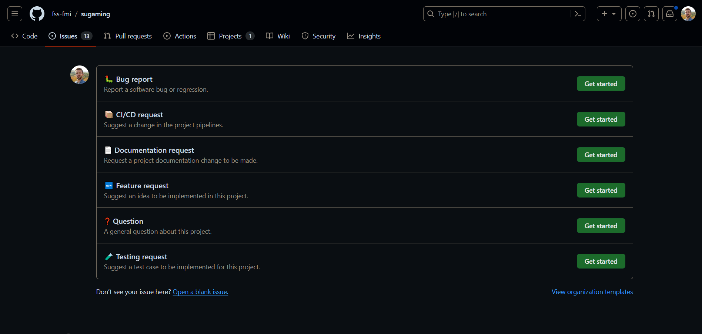

# From a Task to a Feature - Workflow Description

This manual should walk you through the entire process of creating a task (issue), working on it, submitting a pull request, merging and deploying it. The guide will also outline several conventions that you should stick to in the process.

## Table of contents

1. [Issues](#issues)
2. [Project Boards](#project-boards)
3. [Git Branches](#git-branches)
4. [Commit Conventions](#commit-conventions)
5. [Pull Requests (PRs)](#pull-requests-prs)
6. [Preview and Production deployments](#preview-and-production-deployments)

---

## Issues

Issues are a feature of GitHub that allows tracking, discussion, and prioritization of tasks, features, bug fixes, and other issues related to software projects. In this project it is used for task tracking, work assignment and team communication.

To view all the open issues for SUGAMING - [go to this page](https://github.com/fss-fmi/sugaming/issues).

To create an issue, select the `New issues` button and choose an appropriate template to the task you are assigning. In case you need to modify the issue templates, they are stored as markdown files in `.github/ISSUE_TEMPLATE`.

Whenever creating an issue, make sure to stick to the template and give as much context as you currently have. Also, ensure that you have assigned the appropriate labels, project, milestone and assignee(s) in the right-side panel. It's not a problem if a request doesn't initially have an assignee - it can be assigned later.

An open issue is considered as a task to be completed - so whenever a task is completed, make sure to close the issue, wether that will be via a comment or a [pull request](#pull-requests-prs).

## Project Boards

GitHub has a project board feature called "GitHub Projects". It can be used to organize all the project issues and their statuses.

To view the project board for SUGAMING - [go to this page](https://github.com/orgs/fss-fmi/projects/1).

Whenever you open the project board, it will have the following 6 tabs:

- `Personal Tasks` - Tasks assigned to you
- `General` - General task, not related to the API, the site or the admin panel
- `API` - Tasks regarding the API backend
- `Site` - Tasks regarding the front-end client
- `Admin` - Tasks regarding the admin panel
- `All` - All project tasks

Work is sorted in 5 columns: `🔙 Backlog`, `📌 Todo`, `🛠 In Progress`, `🧪 In Validation`, and `🎉 Done`.

You can use the board to organize your personal work or overview tasks across the project.

## Git Branches

Whenever you are working on a task, which requires changes to the project source code, you should create a git branch and make your changes in it. You can associate a GitHub issue with a branch by going to the issue page, and selecting the `Create a branch` button under `Development` in the right-hand side of the page.

When creating a branch, you should specify a name for it. I recommend you including the GitHub issue number in the branch name. Personally, I name my branches `SUG-<ticket number>` (`SUG` is shortened from `SUGAMING`), but you can go with whatever suits you (including the default suggested by GitHub).

Before starting work on a feature, **always remember to `git checkout` your branch locally**. Direct pushes to the `main` branch are restricted.

https://github.com/fss-fmi/sugaming/assets/26301867/a65d1e9d-1381-4fe0-945f-b053aef13cf5

## Commit Conventions

## Pull Requests (PRs)

## Preview and Production Deployments
